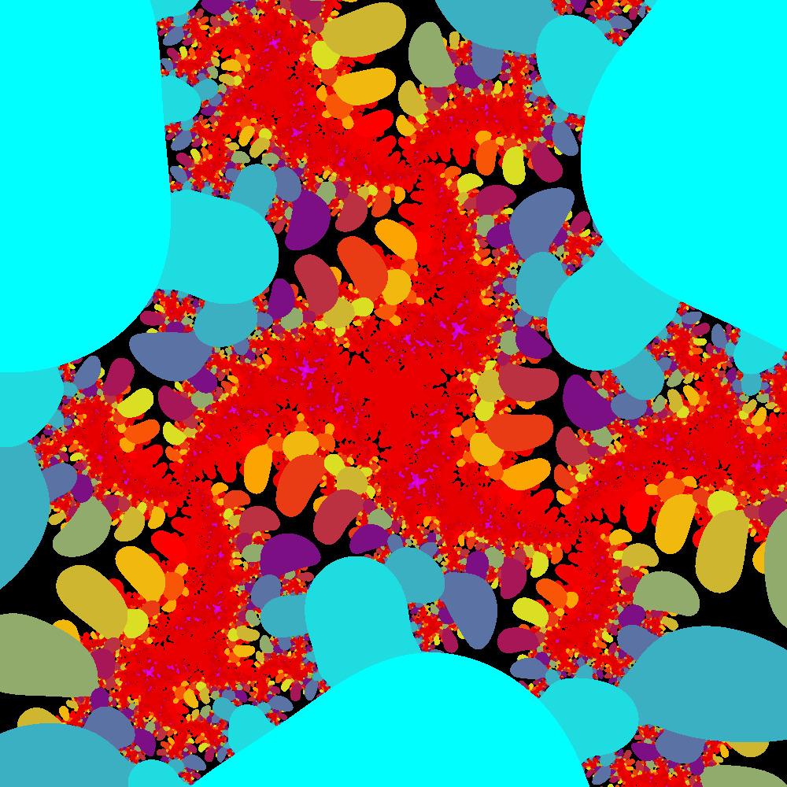

# FractalCode

Code for mostly generating fractals and some spectral analysis and manipulation. Written in C++ with SDL2 and some FFT libraries such as KISS FFT and fftw
Goin to add neural network effects

  

  

  

  

  

  

  

  

  

  

  

  

  

  

  

  

  

  

  

